# Code Logic Diagrams

This document captures the logical flow of driftctl — both how the **legacy** upstream codebase (snyk/driftctl) worked, and how the **current** fork works today.

---

## Legacy Workflow (snyk/driftctl)

### Overview

The original codebase supported four cloud providers (AWS, Azure, GCP, GitHub) with 103+ individual per-resource-type enumerators for AWS alone. Drift detection was purely state-based: compare what Terraform state says should exist against what the cloud provider actually has.

### Top-Level Scan Flow

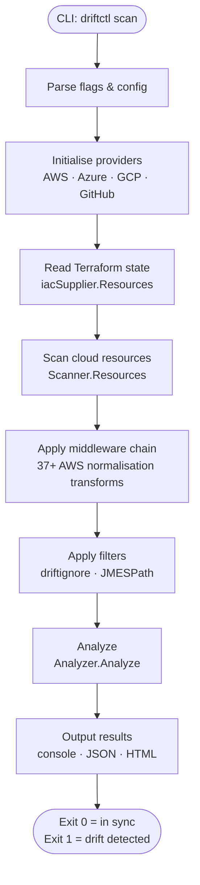

### Enumeration: Per-type Enumerators

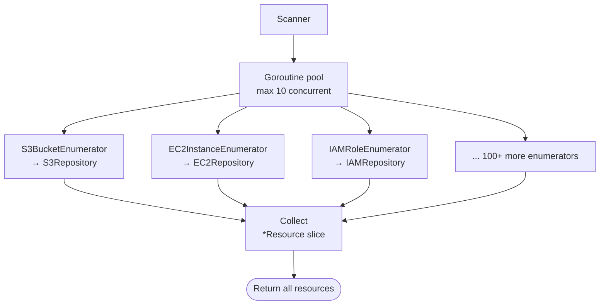

Each enumerator:
1. Calls one AWS API (e.g. `ListBuckets`, `DescribeInstances`)
2. Converts raw SDK types to `*resource.Resource`
3. Returns results into the shared pool

### State Reading

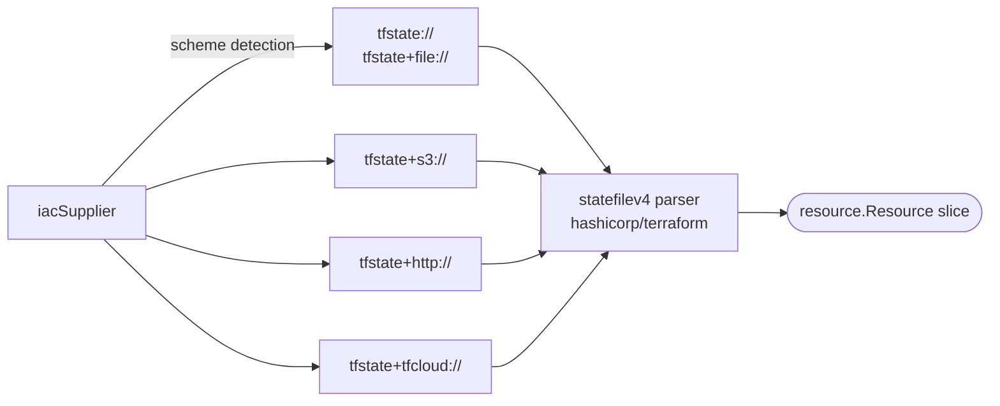

Lock file (`.terraform.lock.hcl`) is read to detect the provider version in use.

### Analysis (State vs Cloud)

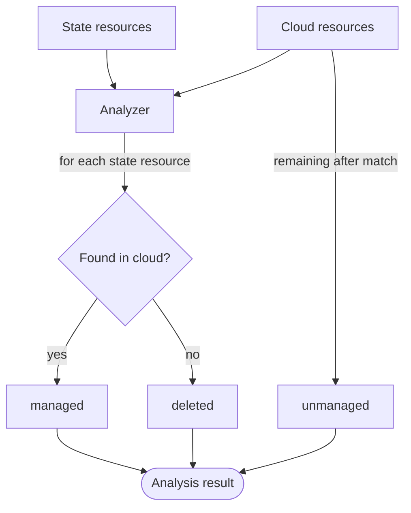

**Output categories:**
- `managed` — resource exists in both state and cloud (in sync)
- `deleted` — resource in state but missing from cloud
- `unmanaged` — resource in cloud but not tracked in state

---

## Current Workflow (this fork, v1.0.0)

### What Changed at a Glance

| Area | Legacy | Current |
|---|---|---|
| Providers | AWS · Azure · GCP · GitHub | **AWS only** |
| Enumeration model | 103 individual enumerators | 1 BulkEnumerator (AWS Config SQL only — no fallback) |
| Scan modes | Inventory only | **Inventory** (default) + **Plan** |
| Drift granularity | Resource existence only | Existence + **attribute-level diffs** (plan mode) |
| Resource categories | None | `cloudformation_managed` · `service_linked` · `unsupported` · `default_resources` |
| AWS SDK | v1 | **v2** (smithy-go errors, paginator APIs) |
| Terraform provider default | 3.19.0 | **6.38.0** |

### Top-Level Scan Flow (mode selection)

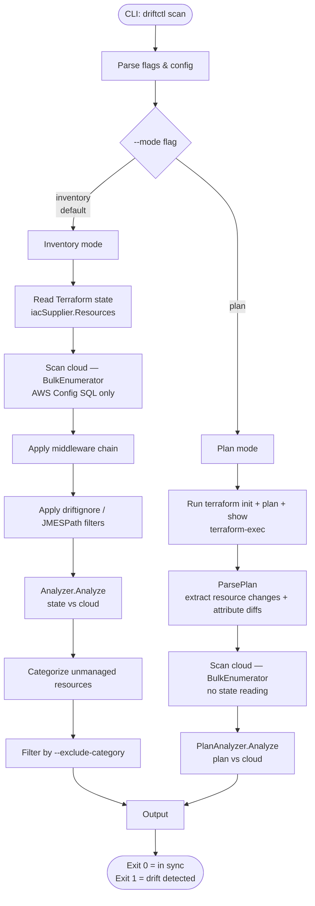

### Enumeration: AWS Config Only

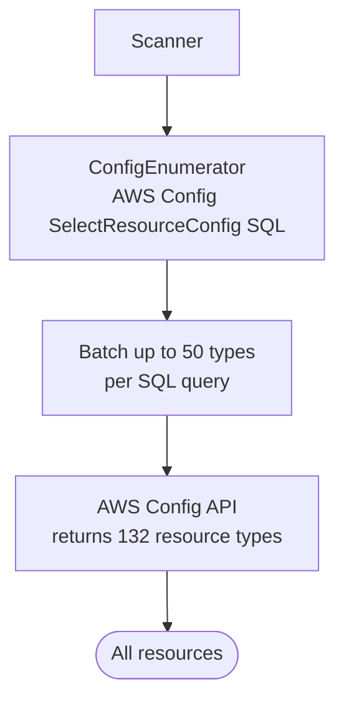

AWS Config covers 132 resource types via a single fast SQL query (enumeration time: ~2 s). There is no individual-enumerator fallback — if a resource type is not indexed by AWS Config, it is not enumerated. This keeps the required IAM permissions minimal: read access to AWS Config and S3 state buckets is sufficient.

### AWS Config Repository

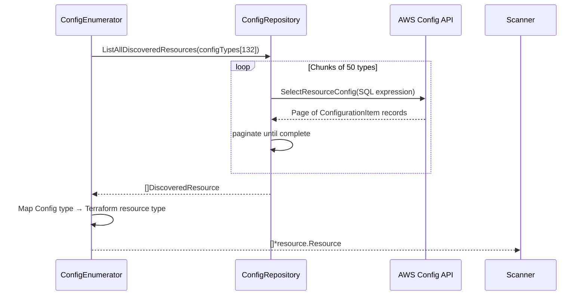

### Inventory Mode Analysis

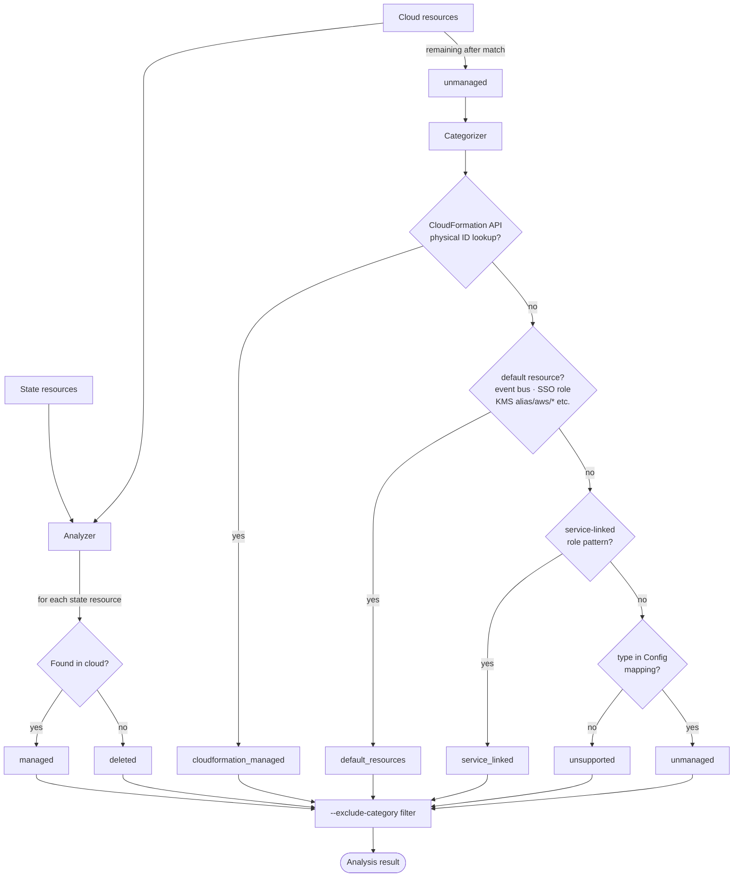

### Plan Mode Analysis

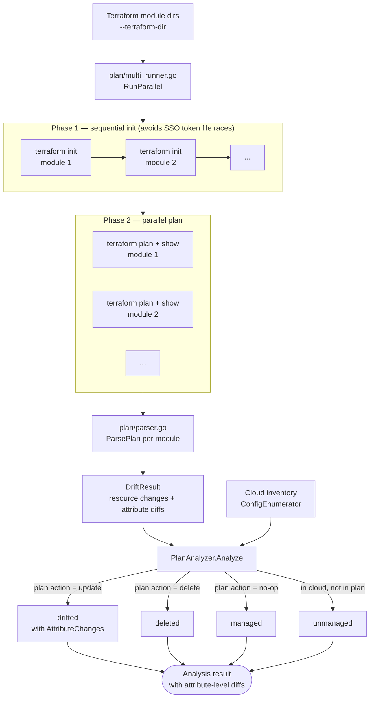

### Categorizer Chain

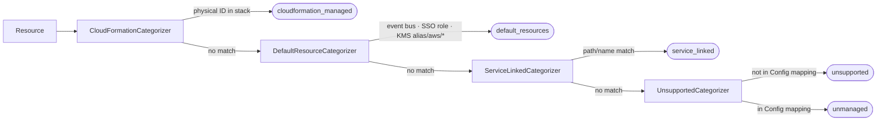

### Output Model

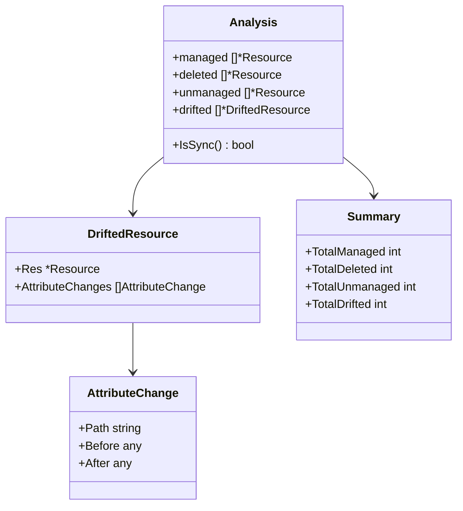

---

## Side-by-Side: Legacy vs Current

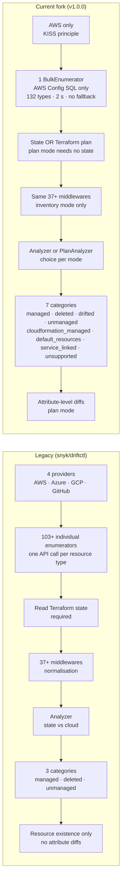

---

## Key File Reference

| Concern | Legacy path | Current path |
|---|---|---|
| CLI entry | `pkg/cmd/scan.go` | `pkg/cmd/scan.go` |
| Orchestration | `pkg/driftctl.go` | `pkg/driftctl.go` |
| Scanner | `enumeration/remote/scanner.go` | `enumeration/remote/scanner.go` |
| AWS init | `enumeration/remote/aws/init.go` (103 AddEnumerator) | `enumeration/remote/aws/init.go` (1 AddBulkEnumerator) |
| AWS enumeration | 103 `*_enumerator.go` files | `enumeration/remote/aws/config_enumerator.go` |
| AWS repository | 20+ `*_repository.go` files | `enumeration/remote/aws/repository/config_repository.go` |
| CloudFormation repository | — | `enumeration/remote/aws/repository/cloudformation_repository.go` |
| Config mapping | — | `enumeration/remote/aws/config_resource_mapping.go` |
| State reading | `pkg/iac/supplier/` | `pkg/iac/supplier/` (unchanged) |
| Middlewares | `pkg/middlewares/` | `pkg/middlewares/` (unchanged) |
| Analyzer | `pkg/analyser/analyzer.go` | `pkg/analyser/analyzer.go` |
| Plan analyzer | — | `pkg/analyser/plan_analyzer.go` |
| Plan runner | — | `pkg/terraform/plan/runner.go` |
| Plan parser | — | `pkg/terraform/plan/parser.go` |
| Categorizer | — | `pkg/categorizer/` |
| Analysis model | `pkg/analyser/analysis.go` | `pkg/analyser/analysis.go` (extended) |
